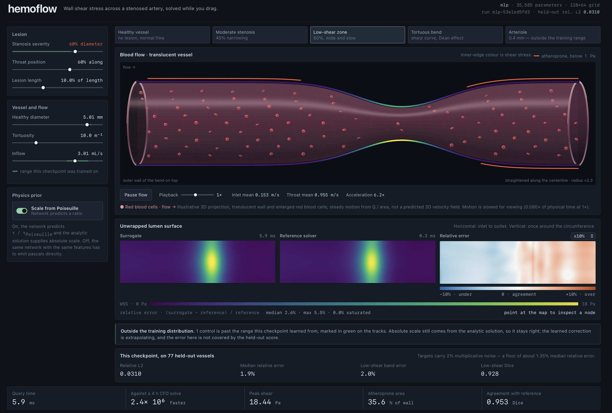

# hemoflow-surrogate

A neural surrogate for hemodynamic wall shear stress, built as an ML engineering
project. Vascular geometry is the application domain; the substance is
representation design, a physics-informed target, leakage-safe evaluation, and a
reproducible pipeline from data generation to a served endpoint.

```
geometry  ->  data  ->  models  ->  training  ->  serving
```

## The problem

Wall shear stress - the tangential drag blood exerts on an artery wall - is a
field you cannot measure directly and must simulate. Computational fluid
dynamics gives the answer and costs hours of CPU per case, which puts it firmly
in the overnight-batch category and out of reach of anything interactive.

A surrogate pays that cost once, offline, to build a training set, then
approximates the geometry-to-field map in milliseconds. This repo is a complete,
tested implementation of that idea with the evaluation machinery to say honestly
how well it works.

> **What the numbers below mean.** The reference fields come from a
> **reduced-order solver** (`geometry/reference.py`), not a 3D Navier-Stokes
> solve. It is a Poiseuille core with physically motivated corrections for
> convective acceleration, post-stenotic separation, entrance development and
> Dean-type secondary flow. Every metric here measures *fidelity to that
> reference*. None of it is a clinical accuracy claim. The solver sits behind a
> one-function interface precisely so it can be swapped for real CFD output
> without touching anything downstream - see
> [`docs/ARCHITECTURE.md`](docs/ARCHITECTURE.md).

## Quickstart

```bash
bash scripts/setup.sh     # CPU torch + this package
make smoke                # data -> train -> eval -> bench, ~40s
```

Then the real thing:

```bash
hemoflow data  --config configs/mlp.yaml     # generate the dataset
hemoflow train --config configs/mlp.yaml     # train and score on held-out test
hemoflow eval  --config configs/mlp.yaml --all-runs   # benchmark vs. baselines
hemoflow bench --config configs/mlp.yaml     # inference latency
make serve                                    # FastAPI on :8000, docs at /docs
```

## The demo

```bash
make train && make ablation && make demo      # http://127.0.0.1:8000/
```

Drag the stenosis slider and the wall-shear-stress field is re-solved between
frames. The vessel view is a fixed-view cylindrical projection with open
elliptical ends, translucent front and rear surfaces, and illustrative red blood
cells moving faster through the narrowed throat. The atheroprone band below 1 Pa
stays marked on the lumen boundary, while the unwrapped field sits beside the
reference solver's answer on a shared colour scale. A switch turns the physics
prior off so the ablation below stops being a table row and starts being
something you watch break. It runs on
localhost with no network access at all, which a test enforces.



The green segment on each slider track is the range this checkpoint was actually
trained on, read out of the config rather than written down. Drag past it and the
page says so. That is not uncertainty quantification - the roadmap is honest that
the model has none - but a demo that cannot say when it has left its training
distribution has no business being convincing.

[`docs/DEMO.md`](docs/DEMO.md) describes what is on screen and what it does not
claim.

<!-- RESULTS:START -->
## Results

512 synthetic vessels on a 128 x 64 grid, scored on 77 held-out vessels never
seen in training. Targets carry 2% multiplicative noise standing in for solver
discretisation error, which puts a floor of **1.35% median relative error** under
anything in this table. Everything below ran on 2 CPU cores.

| model | params | rel. L2 | median rel. err | low-shear rel. err | low-shear Dice | peak err |
| --- | ---: | ---: | ---: | ---: | ---: | ---: |
| **U-Net** | 490,001 | **0.0306** | 1.8% | 1.8% | 0.926 | 3.8% |
| **MLP** | 35,585 | **0.0310** | 1.9% | 2.0% | 0.928 | 3.2% |
| Poiseuille (analytic) | 0 | 0.270 | 18.4% | 16.2% | 0.680 | 31.7% |
| MLP, no physics prior | 35,585 | 0.287 | 18.4% | 17.6% | 0.686 | 16.3% |
| Ridge on the same features | 13 | 0.327 | 21.4% | 23.9% | 0.676 | 22.6% |
| Constant (train mean) | 0 | 0.756 | 47.7% | 166% | 0.416 | 67.5% |

Three things worth reading off it.

**The physics prior is the whole ballgame.** The same MLP, same features, same
budget, differing only in whether it predicts a ratio or absolute pascals:
0.031 against 0.287, a factor of 9. Without the prior the network does not beat
the zero-parameter analytic baseline it was supposed to improve on. This is the
ablation that justifies the design, and it is why `models/physics.py` is the
longest docstring in the repo.

**The U-Net is not worth its 14x parameter count.** 0.0306 against 0.0310 is
noise. The honest reading is that the features already encode the upstream
history a convolution would otherwise have to discover - `throat_ratio` and
`downstream_of_throat` carry exactly the non-local information the
post-stenotic recirculation zone depends on. Spatial context is not free
information here; it was already in the input. That is a negative result and it
stays in the table.

**Both networks are essentially at the noise floor.** 1.8-1.9% median relative
error against an irreducible 1.35% means roughly 1.4x the floor. There is very
little left to win on this dataset, and chasing it would be measuring the noise.
The error maps below show it directly: structured banding for the baselines,
unstructured speckle for the networks.


A 60% stenosis at arc position 0.6. The reference band tilts across the
circumference - that is the Dean effect, higher shear on the outer wall of the
bend. The analytic baseline's band is perfectly horizontal, because Poiseuille
flow has no angular dependence at all, and its error map shows the resulting
structure at 20.9%. Both networks reproduce the tilt and leave only speckle.
Bottom row is the ablation: right shape, wrong scale, systematically.

### Latency

| model | p50 | p95 | batch throughput |
| --- | ---: | ---: | ---: |
| Poiseuille | 0.08 ms | 0.12 ms | 7,100 vessel/s |
| MLP | 5.2 ms | 6.0 ms | 59 vessel/s |
| U-Net | 9.7 ms | 11.9 ms | 67 vessel/s |

Single-vessel, end to end, including the 0.6 ms of feature extraction - which is
a real part of query cost and is reported rather than quietly excluded. Batch
throughput is listed separately because it answers a different question (offline
cohort processing) and quoting it as interactive latency is how these claims get
inflated.

Against a **4-hour assumed** CFD solve, 5.2 ms is a ~2.8e6 speedup. That
denominator is an assumption taken from typical published patient-specific runs,
not something measured here, and `reports/latency.json` records it as such.

Reproduce with `hemoflow eval --config configs/mlp.yaml --all-runs` and
`hemoflow bench --config configs/mlp.yaml --all-runs`.
<!-- RESULTS:END -->

## Three decisions that carry the project

Each of these started as a bug that produced plausible-looking wrong numbers.
Each is now pinned by a test.

**The features are rotation-invariant by construction, not by training.**
Handing a network raw `(x, y, z)` makes it learn from data that a rotated artery
is the same artery, and with a few hundred geometries it will not. Vessels are
reduced to a centerline plus a radius field on an `(arc x circumference)` grid,
with features expressed in a parallel-transport frame whose circumferential
origin is anchored to the vessel's own bend. Rotate a vessel and every feature
is unchanged node for node, which
`test_geometry.py::test_features_are_rotation_invariant` asserts directly.

**The network predicts a dimensionless ratio, not pascals.** Dimensionless
features cannot recover absolute scale: the Reynolds number carries `Q / r`
while shear needs `Q / r^3`. A network asked for pascals just learns its training
calibre - here it confidently returned an ordinary 2 Pa for a 2.5-micron vessel.
So the network predicts `tau_true / tau_poiseuille` and the analytic solution
supplies the scale. Absolute accuracy then holds at any calibre, the target is
well-conditioned near 1 instead of spanning two decades, and the Poiseuille
baseline becomes exactly "predict a ratio of 1" - so the benchmark reads as what
the network adds to textbook physics. `model.physics_residual: false` runs the
ablation.

**The convolutions know the field is a cylinder.** The circumferential axis
wraps; the axial axis has real inlet and outlet boundaries. Zero-padding both -
the stock `Conv2d` default - invents a seam at `theta = 0` that cuts straight
through the Dean-flow variation the model is supposed to learn. `MixedPadConv2d`
pads circularly in theta and by replication along the arc. The decoder needed the
same fix: a plain `F.interpolate` clamps at the edge and reintroduced a ~30%
discontinuity across that seam.

## Evaluation, and why these metrics

Mean absolute error over every node is a bad primary metric here. The target
spans two orders of magnitude, so node-averaged error is dominated by a handful
of stenosis-throat nodes, and a model can post an excellent MAE while being
useless in the low-shear regions - which are the ones that matter, since
persistently low shear is what drives plaque.

So the table carries three kinds of number: scale-free accuracy (relative L2,
median relative error), the same errors restricted to the sub-1 Pa atheroprone
band, and Dice agreement between the predicted and reference low-shear regions -
the closest thing here to the question actually being asked, which is *where* the
at-risk territory is.

Baselines are fitted on the training split only and scored through the same
`Surrogate.predict_pa` interface as the networks, so the comparison is
apples-to-apples.

## Layout

```
src/hemoflow/
  config.py          typed, hashable config; one YAML fully determines a run
  utils.py           seeding, fingerprinting, provenance
  geometry/          vessel representation, frames, features, reference solver
  data/              generation, leakage-safe splits, normalisation, loaders
  models/            interface, baselines, physics prior, networks, checkpoints
  training/          training loop, benchmark harness, metrics
  serving/           FastAPI service, interactive demo, latency benchmark
configs/             one file per experiment
tests/               80 tests; properties, not smoke
scripts/             setup, end-to-end smoke, figures
docs/                architecture, roadmap
```

## Reproducibility

- One YAML config fully determines a run; there are no result-affecting flags.
- Datasets and runs are content-addressed by config hash and written once, so
  re-running an unchanged config is a no-op rather than a silent second copy.
  `dataset_id` hashes only the geometry, fluid and data blocks, so changing a
  learning rate does not invalidate a generated dataset.
- Splits are over whole vessels, never surface nodes. Two nodes a millimetre
  apart on the same artery are nearly the same sample, and splitting them across
  train and test would measure memorisation.
  (`test_data.py::test_splits_are_disjoint_by_vessel`)
- Normalisers are fitted on train only and persisted next to the weights, so a
  run directory is servable on its own and the service cannot re-derive them
  differently. (`test_models.py::test_checkpoint_roundtrip_preserves_predictions`)
- Every manifest records the git SHA and a UTC timestamp.

## Limitations

The reference is reduced-order, not CFD. Geometries are synthetic single-branch
tubes - no bifurcations, no aneurysm sacs, no side branches. Flow is steady,
while real hemodynamics is pulsatile and the clinically interesting oscillatory
shear index needs a time-resolved solve. The model reports no uncertainty, which
is the gap that matters most before anything like this goes near a decision.

[`docs/ROADMAP.md`](docs/ROADMAP.md) has the ordered plan, including what was
deliberately left out and why.

## Contributing

[`CONTRIBUTING.md`](CONTRIBUTING.md) covers setup, the two-lane split of
ownership, branch conventions, and the failure modes specific to this domain
(units, leakage, stale caches).

```bash
make fmt lint test
```
