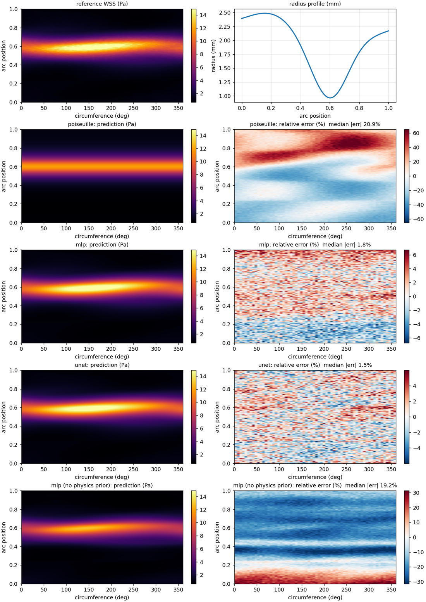

# hemoflow-surrogate

A neural surrogate for hemodynamic wall shear stress, built as an ML engineering
project. Vascular geometry is the application domain; the substance is
representation design, a physics-informed target, leakage-safe evaluation, and a
reproducible pipeline from data generation to a served endpoint.

```
geometry  ->  data  ->  models  ->  training  ->  serving
```

## The problem

Wall shear stress - the tangential drag blood exerts on an artery wall - is a
field you cannot measure directly and must simulate. Computational fluid
dynamics gives the answer and costs hours of CPU per case, which puts it firmly
in the overnight-batch category and out of reach of anything interactive.

A surrogate pays that cost once, offline, to build a training set, then
approximates the geometry-to-field map in milliseconds. This repo is a complete,
tested implementation of that idea with the evaluation machinery to say honestly
how well it works.

> **What the numbers below mean.** The reference fields come from a
> **reduced-order solver** (`geometry/reference.py`), not a 3D Navier-Stokes
> solve. It is a Poiseuille core with physically motivated corrections for
> convective acceleration, post-stenotic separation, entrance development and
> Dean-type secondary flow. Every metric here measures *fidelity to that
> reference*. None of it is a clinical accuracy claim. The solver sits behind a
> one-function interface precisely so it can be swapped for real CFD output
> without touching anything downstream - see
> [`docs/ARCHITECTURE.md`](docs/ARCHITECTURE.md).

## Quickstart

```bash
bash scripts/setup.sh     # CPU torch + this package
make smoke                # data -> train -> eval -> bench, ~40s
```

Then the real thing:

```bash
hemoflow data  --config configs/mlp.yaml     # generate the dataset
hemoflow train --config configs/mlp.yaml     # train and score on held-out test
hemoflow eval  --config configs/mlp.yaml --all-runs   # benchmark vs. baselines
hemoflow bench --config configs/mlp.yaml     # inference latency
make serve                                    # FastAPI on :8000, docs at /docs
```

## The demo

```bash
make train && make ablation && make demo      # http://127.0.0.1:8000/
```

Drag the stenosis slider and the wall-shear-stress field is re-solved between
frames. The vessel view is a fixed-view cylindrical projection with open
elliptical ends, translucent front and rear surfaces, and illustrative red blood
cells moving faster through the narrowed throat. The atheroprone band below 1 Pa
stays marked on the lumen boundary, while the unwrapped field sits beside the
reference solver's answer on a shared colour scale. A switch turns the physics
prior off so the ablation below stops being a table row and starts being
something you watch break. It runs on
localhost with no network access at all, which a test enforces.


The green segment on each slider track is the range this checkpoint was actually
trained on, read out of the config rather than written down. Drag past it and the
page says so. That is not uncertainty quantification - the roadmap is honest that
the model has none - but a demo that cannot say when it has left its training
distribution has no business being convincing.

[`docs/DEMO.md`](docs/DEMO.md) describes what is on screen and what it does not
claim.

<!-- RESULTS:START -->
## Results

512 synthetic vessels on a 128 x 64 grid, scored on 77 held-out vessels never
seen in training. Targets carry 2% multiplicative noise standing in for solver
discretisation error, which puts a floor of **1.35% median relative error** under
anything in this table. Everything below ran on 2 CPU cores.

| model | params | rel. L2 | median rel. err | low-shear rel. err | low-shear Dice | peak err |
| --- | ---: | ---: | ---: | ---: | ---: | ---: |
| **U-Net** | 490,001 | **0.0306** | 1.8% | 1.8% | 0.926 | 3.8% |
| **MLP** | 35,585 | **0.0310** | 1.9% | 2.0% | 0.928 | 3.2% |
| Poiseuille (analytic) | 0 | 0.270 | 18.4% | 16.2% | 0.680 | 31.7% |
| MLP, no physics prior | 35,585 | 0.287 | 18.4% | 17.6% | 0.686 | 16.3% |
| Ridge on the same features | 13 | 0.327 | 21.4% | 23.9% | 0.676 | 22.6% |
| Constant (train mean) | 0 | 0.756 | 47.7% | 166% | 0.416 | 67.5% |

Three things worth reading off it.

**The physics prior is the whole ballgame.** The same MLP, same features, same
budget, differing only in whether it predicts a ratio or absolute pascals:
0.031 against 0.287, a factor of 9. Without the prior the network does not beat
the zero-parameter analytic baseline it was supposed to improve on. This is the
ablation that justifies the design, and it is why `models/physics.py` is the
longest docstring in the repo.

**The U-Net does not earn its 14x parameter count.** 0.0306 against 0.0310, one
seed each, with the MLP ahead on low-shear Dice and peak error. The honest
reading is that the two are *indistinguishable on this dataset* - not that either
is better. Separating them would need repeated seeds and confidence intervals,
which we have not run.

The likely explanation, which we have **not** measured, is that the features
already encode the upstream history a convolution would otherwise have to
discover: `throat_ratio` and `downstream_of_throat` carry the non-local
information the post-stenotic recirculation zone depends on. Testing that needs
the feature ablation in [`docs/ROADMAP.md`](docs/ROADMAP.md). Until it is run it
is a hypothesis, not a finding. The negative result stays in the table either
way.

**Both networks are essentially at the noise floor.** 1.8-1.9% median relative
error against an irreducible 1.35% means roughly 1.4x the floor. There is very
little left to win on this dataset, and chasing it would be measuring the noise.
The error maps below show it directly: structured banding for the baselines,
unstructured speckle for the networks.



A 60% stenosis at arc position 0.6. The reference band tilts across the
circumference - that is the Dean effect, higher shear on the outer wall of the
bend. The analytic baseline's band is perfectly horizontal, because Poiseuille
flow has no angular dependence at all, and its error map shows the resulting
structure at 20.9%. Both networks reproduce the tilt and leave only speckle.
Bottom row is the ablation: right shape, wrong scale, systematically.

### Latency

| model | p50 | p95 | batch throughput |
| --- | ---: | ---: | ---: |
| Poiseuille | 0.08 ms | 0.12 ms | 7,100 vessel/s |
| MLP | 5.2 ms | 6.0 ms | 59 vessel/s |
| U-Net | 9.7 ms | 11.9 ms | 67 vessel/s |

The p50 and p95 columns time `Surrogate.predict_pa` alone. Feature extraction is
measured separately at **0.6 ms** (`bench.py::measure_feature_cost`) and reported
alongside, so a full single-vessel query costs their sum - about 5.8 ms for the
MLP. Batch throughput answers a different question (offline cohort processing);
quoting it as interactive latency is how these claims get inflated.

Two things this table does **not** show:

- **There is no measured speedup anywhere in this repository.** The reduced-order
  reference solver runs in roughly **0.4 ms per vessel**, so the surrogate is
  about **12x slower than the thing it imitates**. That is expected - the
  surrogate exists to stand in for a 3D CFD solve, and the reduced-order model is
  itself a stand-in for one - but no number here demonstrates an acceleration.
- Against a **4-hour assumed** CFD solve, 5.8 ms would be a ~2.5e6 speedup. That
  denominator is an assumption drawn from typical published patient-specific
  runs, not a measurement; `reports/latency.json` records it as such. It is a
  statement about published CFD costs, not a result of this work.

Reproduce with `hemoflow eval --config configs/mlp.yaml --all-runs` and
`hemoflow bench --config configs/mlp.yaml --all-runs`.
<!-- RESULTS:END -->

## Three decisions that carry the project

Each of these started as a bug that produced plausible-looking wrong numbers.
Each is now pinned by a test.

**The features are rotation-invariant by construction, not by training.**
Handing a network raw `(x, y, z)` makes it learn from data that a rotated artery
is the same artery, and with a few hundred geometries it will not. Vessels are
reduced to a centerline plus a radius field on an `(arc x circumference)` grid,
with features expressed in a parallel-transport frame whose circumferential
origin is anchored to the vessel's own bend. Rotate a vessel and every feature
is unchanged node for node, which
`test_geometry.py::test_features_are_rotation_invariant` asserts directly.

**The network predicts a dimensionless ratio, not pascals.** Dimensionless
features cannot recover absolute scale: the Reynolds number carries `Q / r`
while shear needs `Q / r^3`. A network asked for pascals just learns its training
calibre - here it confidently returned an ordinary 2 Pa for a 2.5-micron vessel.
So the network predicts `tau_true / tau_poiseuille` and the analytic solution
supplies the scale. Absolute accuracy then holds at any calibre, the target is
well-conditioned near 1 instead of spanning two decades, and the Poiseuille
baseline becomes exactly "predict a ratio of 1" - so the benchmark reads as what
the network adds to textbook physics. `model.physics_residual: false` runs the
ablation.

**The convolutions know the field is a cylinder.** The circumferential axis
wraps; the axial axis has real inlet and outlet boundaries. Zero-padding both -
the stock `Conv2d` default - invents a seam at `theta = 0` that cuts straight
through the Dean-flow variation the model is supposed to learn. `MixedPadConv2d`
pads circularly in theta and by replication along the arc. The decoder needed the
same fix: a plain `F.interpolate` clamps at the edge and reintroduced a ~30%
discontinuity across that seam.

## Evaluation, and why these metrics

Mean absolute error over every node is a bad primary metric here. The target
spans two orders of magnitude, so node-averaged error is dominated by a handful
of stenosis-throat nodes, and a model can post an excellent MAE while being
useless in the low-shear regions - which are the ones that matter, since
persistently low shear is what drives plaque.

So the table carries three kinds of number, and the difference between the first
two matters more than it looks:

- **Relative L2** is *scale-invariant*, which is not the same as per-node
  scale-free. Multiply the whole field by a constant and the metric is unchanged,
  but within one field its sum of squares is still dominated by the high-shear
  throat nodes: a 10% error at 30 Pa contributes ten thousand times more to it
  than a 10% error at 0.3 Pa.
- **Median relative error** is the per-node scale-free one. It weighs a 10% miss
  at 0.3 Pa exactly like a 10% miss at 30 Pa.
- **The low-shear columns and Dice** restrict attention to the sub-1 Pa
  atheroprone band - the closest thing here to the question actually being asked,
  which is *where* the at-risk territory is.

Reporting all three is the point. No single one of them would catch a model that
is accurate at throats and useless in recirculation zones.

Baselines are fitted on the training split only and scored through the same
`Surrogate.predict_pa` interface as the networks, so the comparison is
apples-to-apples.

## Layout

```
src/hemoflow/
  config.py          typed, hashable config; one YAML fully determines a run
  utils.py           seeding, fingerprinting, provenance
  geometry/          vessel representation, frames, features, reference solver
  data/              generation, leakage-safe splits, normalisation, loaders
  models/            interface, baselines, physics prior, networks, checkpoints
  training/          training loop, benchmark harness, metrics
  serving/           FastAPI service, interactive demo, latency benchmark
configs/             one file per experiment
tests/               80 tests; properties, not smoke
scripts/             setup, end-to-end smoke, figures
docs/                architecture, roadmap, per-module verification notes
```

## Reproducibility

- One YAML config determines which experiment runs; there are no result-affecting
  flags.
- Datasets are content-addressed by config hash and written once, so re-running
  `hemoflow data` on an unchanged config is a no-op. `dataset_id` hashes only the
  geometry, fluid and data blocks, so changing a learning rate does not
  invalidate a generated dataset.
- **Training is not a no-op.** `hemoflow train` on an unchanged config retrains
  and overwrites the same run directory. The directory name comes from the config;
  the weights inside it are whatever the most recent run produced.
- **A matching `run_id` proves the configs matched, not that the bits match.**
  Some backward kernels on Apple Silicon are non-deterministic and say so at
  runtime, so two runs of one config can differ numerically. Content addressing
  buys traceability, not bitwise reproducibility.
- **The dataset hash cannot see the solver's code.** `dataset_id` is computed from
  config alone, so editing `geometry/reference.py` without changing a config value
  leaves a stale cached dataset in place and nothing will warn you. Run
  `hemoflow data --force` after any change to what generation produces.
- Splits are over whole vessels, never surface nodes. Two nodes a millimetre
  apart on the same artery are nearly the same sample, and splitting them across
  train and test would measure memorisation.
  (`test_data.py::test_splits_are_disjoint_by_vessel`)
- Normalisers are fitted on train only and persisted next to the weights, so a
  run directory is servable on its own and the service cannot re-derive them
  differently. (`test_models.py::test_checkpoint_roundtrip_preserves_predictions`)
- Every manifest records the git SHA and a UTC timestamp.

## Limitations

The reference is reduced-order, not CFD. Geometries are synthetic single-branch
tubes - no bifurcations, no aneurysm sacs, no side branches. Flow is steady,
while real hemodynamics is pulsatile and the clinically interesting oscillatory
shear index needs a time-resolved solve. The model reports no uncertainty, which
is the gap that matters most before anything like this goes near a decision.

[`docs/ROADMAP.md`](docs/ROADMAP.md) has the ordered plan, including what was
deliberately left out and why.

## Who built what

Two people, one weekend. The split below is the module ownership we worked to,
and each of us is responsible for being able to run, modify and explain
everything under our own name.

**Bowen Zhao** - geometry, data, physics, evaluation.
`geometry/` (vessel representation, parallel-transport frames, the twelve
features, the reduced-order reference solver); `data/` (generation, leakage-safe
splits, normalisation); the physics-prior formulation in `models/physics.py`;
`training/` (training loop, metrics, benchmark harness); and the failure-case
analysis in `scripts/worst_vessel.py`. Verification:
[#11](https://github.com/BobZ06/hemoflow-surrogate/pull/11),
[#12](https://github.com/BobZ06/hemoflow-surrogate/pull/12),
[#13](https://github.com/BobZ06/hemoflow-surrogate/pull/13),
[#14](https://github.com/BobZ06/hemoflow-surrogate/pull/14),
[#15](https://github.com/BobZ06/hemoflow-surrogate/pull/15),
[#16](https://github.com/BobZ06/hemoflow-surrogate/pull/16).

**Letian Wang** - architectures, checkpoints, serving.
`models/nets.py` (the per-node MLP, the U-Net, `MixedPadConv2d` and
`topology_aware_upsample`); checkpoint save, load and round-trip in
`models/registry.py`; and `serving/` (the FastAPI service, the interactive demo
page, input validation, offline operation). Verification:
[#17](https://github.com/BobZ06/hemoflow-surrogate/pull/17),
[#18](https://github.com/BobZ06/hemoflow-surrogate/pull/18),
[#19](https://github.com/BobZ06/hemoflow-surrogate/pull/19).

Shared, changed by agreement: `config.py`, `cli.py`, `utils.py`.

The contract between the two halves is deliberately small: `extract_features`
returns an `(n_arc, n_theta, N_FEATURES)` float32 tensor described by
`FEATURE_NAMES`, and every model implements `Surrogate.predict_pa` and returns
pascals. Changing `FEATURE_NAMES` invalidates every checkpoint, because the input
width changes.

[`docs/verification/`](docs/verification) holds one note per module: what it
does, what each of us checked, and what has not been checked yet.

```bash
make fmt lint test    # CI runs these plus the end-to-end smoke; nothing merges red
```
